<h1> Hi there! I'm <code>pMnerfed</code> </h1>

<!-- Profile Views (currently commented)

  
 -->

### 👨🏻‍💻 &nbsp;About Me

💡 &nbsp;I like to explore new technologies and read new research in ML space.  
🌱 &nbsp;I’m currently interested in system design for distributed systems.  

💬 &nbsp;If you have any question/feedback, please do not hesitate to reach out to me!

<!--
**pmnerfed/pmnerfed** is a ✨ _special_ ✨ repository because its `README.md` (this file) appears on your GitHub profile.

Here are some ideas to get you started:

- 🔭 I’m currently working on ...
- 🌱 I’m currently learning ...
- 👯 I’m looking to collaborate on ...
- 🤔 I’m looking for help with ...
- 💬 Ask me about ...
- 📫 How to reach me: ...
- 😄 Pronouns: ...
- ⚡ Fun fact: ...
-->

&nbsp;

## ⚙️ &nbsp;Github Stats

<!-- 

<a href="https://github.com/pmnerfed">
  
   
   
  
   
  <!--  ->
  </a>

 -->

## 🤝🏻 &nbsp;Connect with me

<!-- &nbsp;&nbsp; &nbsp;&nbsp;
 -->

<a>

